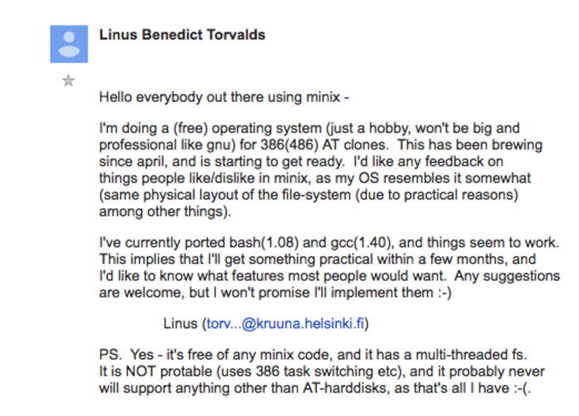
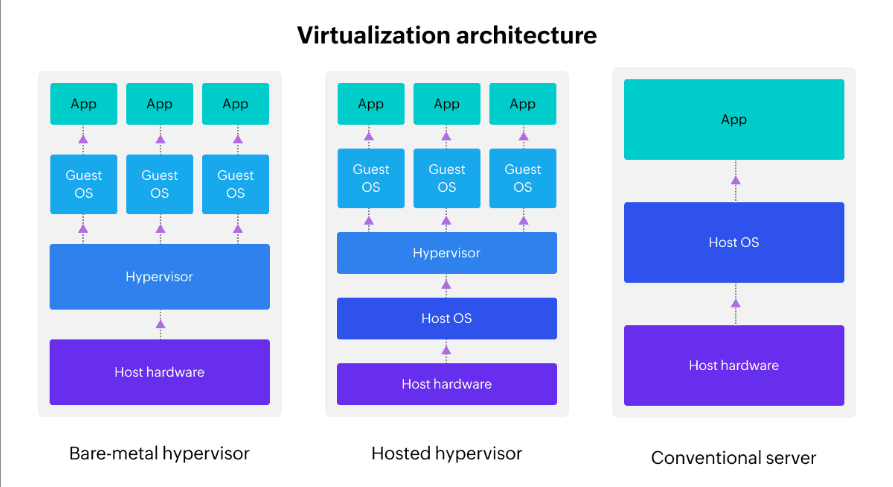
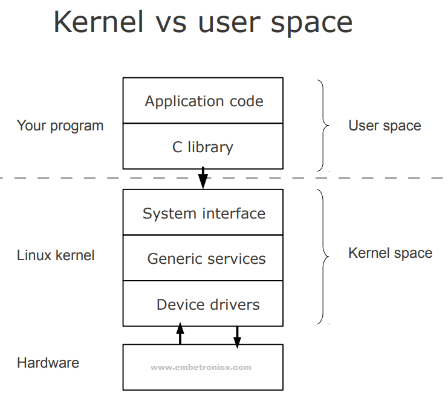
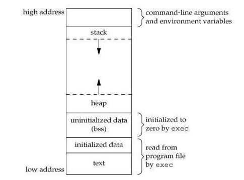
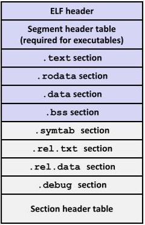
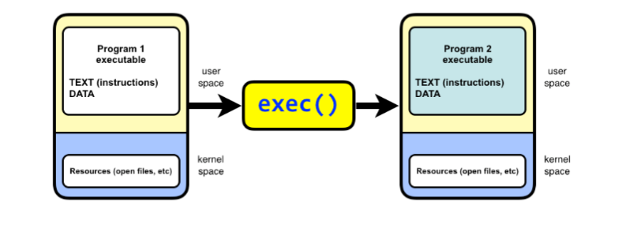
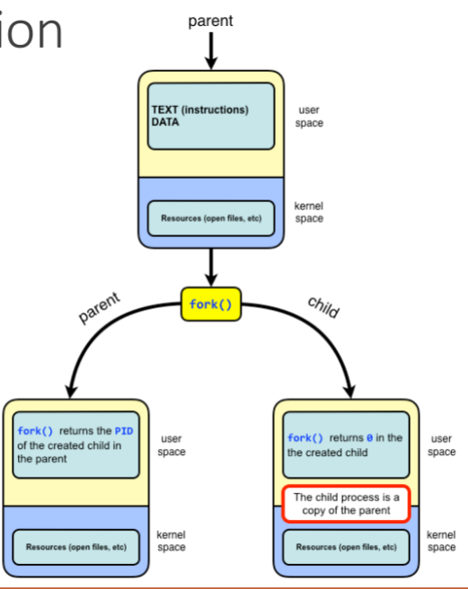
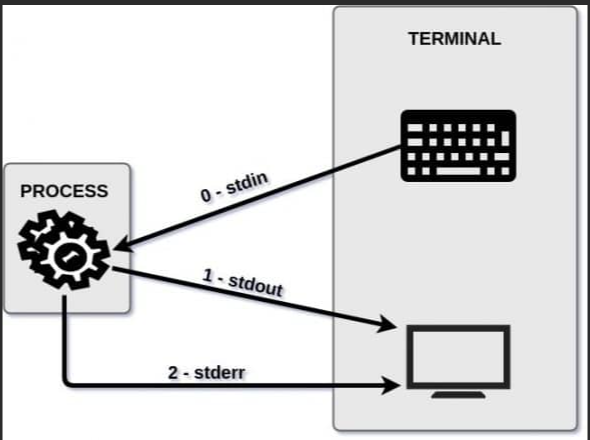

# Introduction To Linux System Programming 
- In this training, i got a good introduction to linux system programming with totally 9 sessions and 45 hours of training under supervision of Eng/Reda Maher at STMicroelectronics Egypt Branch.

# Training Content: 
1. Linux History.
2. Introduction To Virtualization.
3. Basic Command Line Usage and build process.
4. Some Information about linux internals.
5. Processes in Linux.
6. Filesystems.

## Note: 
- According to file systems, i will talk about it in much details in the second training documentation, because it is taken in much details there, so i will talk about it from the beginning till advance :).

## A. Linux History: -
- The first UNIX operating system was developed in 1969 by Ken Thompson at AT&T's Bell Laboratories. Initially written in assembler for the PDP-7 mini-computer, it was named "UNIX" as a pun on the earlier MULTICS project. UNIX borrowed key ideas from MULTICS, such as a tree-structured file system and the concept of files as streams of bytes.

- In 1970, UNIX was rewritten for the more powerful PDP-11 mini-computer. Soon after, Dennis Ritchie, Thompson's colleague, developed the C programming language, which allowed UNIX to be rewritten in C by 1973. This made UNIX one of the first operating systems written in a high-level language, enabling it to be ported to different hardware.

- In 1984, Richard Stallman initiated the GNU Project to create a "free" UNIX-like operating system, where "free" meant legal freedom to use, modify, and distribute software. Stallman opposed proprietary software, which restricted access to source code, and founded the Free Software Foundation (FSF) in 1985 to support this cause. The GNU project developed key software, including the Emacs editor, GCC (GNU Compiler Collection), and the bash shell. However, it lacked a working UNIX kernel.

- Stallman began work on the GNU HURD kernel, but it was not yet functional by the early 1990s. Since much of the software in a typical Linux distribution originated from the GNU project, Stallman prefers the term "GNU/Linux." The issue of whether to call the system Linux or GNU/Linux remains debated in the community.

- In 1991, Linus Torvalds, a student at the University of Helsinki, created a kernel for the Intel 80386 PC. Inspired by Minix, a small UNIX-like system, Torvalds developed a more efficient kernel that could run GNU programs. On October 5, 1991, he announced version 0.02 of his kernel, which he later named "Linux." Initially released under a restrictive license, Torvalds soon made it available under the GNU GPL.

- Linux gained momentum as other programmers joined Torvalds to add features like networking and improved file systems. The first stable release, version 1.0, came in 1994, followed by versions 1.2 (1995), 2.0 (1996), and 2.6 (2003).




## B - Virtualization :-
### Virtualization and Emulation Explained

**Virtualization** and **emulation** are technologies that allow multiple operating systems or applications to run on a single machine, enabling the efficient use of hardware resources. Both concepts are widely used in cloud computing, data centers, and development environments. Let’s dive into the details.

---

### 1. Virtualization

**Virtualization** refers to the creation of virtual (rather than actual) versions of hardware resources, such as operating systems, storage devices, or network resources. The goal of virtualization is to allow one machine (called the **host**) to run multiple isolated instances of another machine (called the **guest**).

- **Host**: The physical machine that provides the resources (CPU, memory, etc.) for the virtualized environment.
- **Guest**: The virtualized machine, which runs its own operating system and applications, but relies on the host for physical resources.
- **Hypervisor**: The software layer that enables virtualization by managing guest operating systems and virtual machines (VMs). It controls the allocation of hardware resources between the guest and host systems.

#### Types of Virtualization

1. #### Full Virtualization  
   In **Full Virtualization**, the guest operating system runs completely isolated from the host, as if it were running on its own physical hardware. The hypervisor emulates all hardware resources needed by the guest OS.

   - The hypervisor manages the interaction between the guest OS and the actual hardware. The guest OS is unaware that it's running in a virtualized environment.
   - **Example**: VMware, Microsoft Hyper-V, and KVM.
   - **Advantages**: The guest OS doesn’t need any modification to run, and it can run any OS (e.g., Linux guest on a Windows host).
   - **Disadvantages**: Full virtualization may have some performance overhead because the hypervisor has to emulate the hardware.

   **Example**: You could run a virtualized version of Windows on a Linux machine with no modifications to Windows.

2. #### Paravirtualization  
   In **Paravirtualization**, the guest OS is aware that it is running in a virtualized environment. It communicates directly with the hypervisor through a special interface (called the "hypercall"). The guest OS is modified to be more aware of the hypervisor to improve performance.

   - Instead of virtualizing the entire hardware stack, the hypervisor provides an interface that allows the guest OS to directly access certain resources in a more efficient manner.
   - **Example**: Xen hypervisor with paravirtualized Linux guest.
   - **Advantages**: Typically results in better performance than full virtualization, as there’s no need to emulate hardware.
   - **Disadvantages**: The guest OS must be modified to support paravirtualization, meaning you can't run just any OS.

   **Example**: Xen with a paravirtualized Linux guest runs faster because the guest OS can directly interact with the hypervisor.

#### Components

1. **Host**: The physical machine where the hypervisor runs and allocates resources for virtual machines.
2. **Guest**: The virtual machine running its own operating system, managed by the hypervisor.
3. **Supervisor** (also known as the **Hypervisor**): The software layer that manages the virtual machines and ensures they have access to physical resources without interfering with each other.


### Hypervisor Types

There are two primary types of hypervisors: **Type 1** (bare-metal) and **Type 2** (hosted).

1. #### Type 1 Hypervisor (Bare-Metal Hypervisor)  
   A **Type 1 hypervisor** runs directly on the physical hardware without needing a host operating system. It is installed on the bare metal of the host machine and controls all virtual machines.

   - **Examples**: VMware ESXi, Microsoft Hyper-V, Xen.
   - **Advantages**: More efficient and faster because it interacts directly with the hardware.
   - **Disadvantages**: Typically requires more specialized hardware and is more complex to set up.

   **Example**: VMware ESXi runs directly on a server's hardware, allowing you to create and manage multiple virtual machines without an underlying host OS.

2. #### Type 2 Hypervisor (Hosted Hypervisor)  
   A **Type 2 hypervisor** runs on top of an existing operating system (the host). It relies on the host OS to interact with the hardware and allocate resources to the virtual machines.

   - **Examples**: VirtualBox, VMware Workstation, Parallels.
   - **Advantages**: Easier to set up and manage, as it runs on top of an existing OS.
   - **Disadvantages**: Slower than Type 1 hypervisors because the host OS adds an extra layer of overhead.

   **Example**: VMware Workstation is a Type 2 hypervisor, which runs on top of Windows or Linux, enabling you to create virtual machines within the existing host OS.


### 2. Emulation

**Emulation** refers to the simulation of one system by another. Unlike virtualization, which creates a virtual version of a real machine, emulation mimics the behavior of a different architecture. For example, running software written for an x86 architecture on an ARM system would require emulation, as the instruction sets are completely different.

- **Emulator**: Software that mimics the behavior of one machine (or device) on another. For example, QEMU can emulate various hardware platforms.
- **Use case**: Emulation is often used for running software designed for other hardware architectures, or in environments where the underlying hardware isn't available.
- **Example**: Emulating a PlayStation game console on a PC.


## C - Basic Linux Commands :-

#### Types of Linux Commands
1. **Built-in Commands**: These commands are built into the shell and don't require any external programs. Examples include `cd`, `pwd`, `exit`, and `echo`.
2. **Hashed Commands**: These are external commands or programs that are stored in the system's directories (like `/bin`, `/usr/bin`). When you run these commands, the shell looks them up using a hash table to improve lookup speed. Examples include `ls`, `cp`, `mv`, and `cat`.
- We can detect the type of command using `which` command.

##### Commands taken in the session:

| Command | Description |
|---------|-------------|
| `cd`    | Change directory |
| `ls`    | List directory contents |
| `pwd`   | Print working directory |
| `echo`  | Print text to the terminal |
| `man`   | Show manual pages for a command |
| `cp`    | Copy files or directories |
| `mv`    | Move or rename files or directories |
| `rm`    | Remove files or directories |
| `cat`   | Display the content of a file |
| `touch` | Create an empty file or update its timestamp |
| `mkdir` | Create a new directory |
| `rmdir` | Remove an empty directory |

## D.Some Information about linux internal:-

### Kernel Space vs. User Space:

- In operating systems, the memory is divided into two primary areas: **Kernel Space** and **User Space**. These two regions have different purposes and provide various levels of access to system resources. Understanding the distinction between them is fundamental to how modern operating systems (such as Linux) manage processes, memory, and security.


### **1. Kernel Space**

- **Definition**: Kernel space is the part of memory where the operating system kernel and its core services reside. The kernel has unrestricted access to all system resources, including hardware, memory, and devices.
  
- **Location**: It resides in the higher part of the system's memory address space, typically in the upper 4GB of the addressable memory in a 32-bit system or higher ranges in a 64-bit system.

- **Access**: Only the kernel has access to kernel space. Regular user processes cannot directly interact with or modify kernel space.

- **Responsibilities**:
  - **Hardware Interaction**: The kernel manages hardware resources like the CPU, memory, and I/O devices (e.g., disk, network interfaces).
  - **System Calls**: When a user process needs to perform an operation that requires privileged access (like reading from the disk or accessing hardware), it must request the kernel to handle it through system calls.
  - **Process Scheduling**: The kernel schedules tasks and manages process execution.
  - **Memory Management**: The kernel handles memory allocation, deallocation, and protection, ensuring that processes don’t interfere with each other’s memory.

- **Protection**: Since the kernel has complete control over the system, it operates in **privileged mode** (also known as **supervisor mode** or **ring 0** in x86 architecture). Any errors or bugs in kernel space could potentially crash the whole system.

### **2. User Space**

- **Definition**: User space is the portion of memory where user applications and processes run. These processes interact with the operating system through system calls but cannot directly access or alter kernel space.

- **Location**: User space is located in the lower portion of the system's memory address space, typically occupying the lower 3GB or so of the addressable memory in a 32-bit system.

- **Access**: Processes in user space are restricted from accessing hardware directly. They rely on the kernel to perform privileged operations.

- **Responsibilities**:
  - **Application Execution**: Most of the programs you run (e.g., web browsers, text editors, games) run in user space.
  - **Libraries and Tools**: User space also includes libraries (e.g., glibc, libstdc++) and tools that help user programs interact with the operating system.
  - **User-level System Calls**: When a user application needs to perform an action that requires higher privileges (such as file access, network communication, or device interaction), it uses **system calls** to request the kernel's help.

- **Protection**: User space operates in **unprivileged mode** (also called **user mode** or **ring 3** in x86 architecture). A crash in user space usually affects only the application in question, leaving the rest of the system intact.

### **Interactions Between Kernel Space and User Space**

- **System Calls**: The most common way user-space applications interact with kernel space is through **system calls**. These are requests made by a user process to the kernel to perform actions that require higher privileges. For example:
  - Reading or writing to files (e.g., `read()`, `write()` system calls).
  - Creating or terminating processes (e.g., `fork()`, `exit()`).
  - Allocating memory (e.g., `malloc()` which eventually calls `brk()` or `mmap()` in the kernel).

- **Context Switching**: When a user-space program needs to request kernel services, the CPU performs a **context switch**, which involves switching from user mode to kernel mode, executing the system call, and then switching back to user mode once the call is completed.

### Memory Segments:

1. **Text Segment**: This segment contains the program’s executable code (machine instructions). It is typically **read-only** to prevent modification of the code during execution.

2. **Data Segment**: It stores initialized global and static variables. It is divided into:
   - **Initialized data**: Variables with predefined values.
   - **Uninitialized data (BSS)**: Variables that are zero-initialized at runtime.

3. **Heap Segment**: The heap is used for **dynamic memory allocation**. Memory in the heap is allocated and deallocated at runtime using functions like `malloc()` and `free()`.

4. **Stack Segment**: The stack stores **local variables**, function parameters, and return addresses. It operates on a **last-in, first-out (LIFO)** basis and grows downward as functions are called.


### ELF Format:

### ELF Format (Executable and Linkable Format)

The **Executable and Linkable Format (ELF)** is the standard file format for executables, object code, shared libraries, and core dumps in Unix-based systems, including Linux. It provides a flexible and extensible format for linking and loading programs.

---

### Key Components of an ELF File

An ELF file is divided into multiple sections and segments, each serving a specific purpose:

1. **ELF Header**:
   - The ELF header is located at the beginning of the file and contains metadata about the file, such as the type of file (e.g., executable or shared library), architecture (e.g., x86, ARM), and entry point (the address where the program begins execution).
  
2. **Program Header Table**:
   - This table defines the segments of the file. Each entry describes how the file is to be loaded into memory. It includes information like memory locations, permissions (read, write, execute), and size.

3. **Section Header Table**:
   - The section header table contains entries that describe sections of the file (such as code, data, and symbol tables). These sections are primarily used during linking and loading but not directly loaded into memory.

4. **Sections**:
   - **Text Section**: Contains the executable code of the program (i.e., the instructions that the CPU will execute).
   - **Data Section**: Stores initialized global and static variables.
   - **BSS Section**: Stores uninitialized global variables, which are zero-initialized at runtime.
   - **Other Sections**: These may include sections for debugging information, string literals, symbol tables, and relocation data.

5. **Segments**:
   - Segments are contiguous regions of memory used during the execution of the program. They are described in the program header table and include:
     - **Code Segment (Text Segment)**: Contains executable instructions.
     - **Data Segment**: Contains initialized data.
     - **Heap Segment**: Used for dynamically allocated memory.
     - **Stack Segment**: Used for function calls and local variables.

6. **Entry Point**:
   - The entry point in the ELF file is the address where execution begins. It is specified in the ELF header and tells the system where to start the program.

---

### Structure of an ELF File

The basic structure of an ELF file includes:

- **ELF Header**: Information about the file.
- **Program Header Table**: Describes segments for loading into memory.
- **Section Header Table**: Describes sections for linking and debugging.
- **Sections**: Actual data for code, variables, and other program components.
  
---

### ELF File Types

- **Executable**: A file that contains code and data ready to be executed.
- **Shared Libraries**: Dynamic libraries that can be loaded by multiple programs at runtime.
- **Object Files**: Intermediate files created by the compiler containing machine code, which can be linked into executables or shared libraries.
- **Core Dumps**: A dump of memory from a running process, typically generated during a crash for debugging.


### ELF Header Example:

A simplified ELF header might look like this in terms of fields:

- **e_ident**: Magic number (indicates ELF format) and architecture.
- **e_type**: Type of the file (executable, shared library, etc.).
- **e_machine**: The target architecture (e.g., x86, ARM).
- **e_version**: The version of the ELF format.
- **e_entry**: The entry point address (where execution begins).
- **e_phoff**: Offset to the program header table.
- **e_shoff**: Offset to the section header table.



### I/O Redirection in Linux

I/O redirection in Linux allows you to control where a command's input and output go, instead of using the default input/output sources. It enables input to come from files, output to be saved to files, and error messages to be handled separately.

### Types of I/O Redirection

1. **Standard Output Redirection (`>` and `>>`)**  
   Redirects the output of a command to a file. The `>` symbol overwrites the file, while `>>` appends to the file.

2. **Standard Input Redirection (`<`)**  
   Redirects the input to a command from a file.

3. **Standard Error Redirection (`2>` and `2>>`)**  
   Redirects the error output (stderr) of a command to a file. The `2>` symbol overwrites the file, while `2>>` appends to it.

### Pipelining in Linux

Pipelining in Linux is a technique that allows you to pass the output of one command directly as the input to another command, forming a chain of commands. The output of one command becomes the input for the next, enabling complex workflows and efficient data processing.

#### Pipe Symbol (`|`)
   The pipe symbol (`|`) is used to connect multiple commands. The standard output of the command on the left side of the pipe is passed as the standard input to the command on the right side.

### Introduction to System Calls in Linux

System calls provide the interface between user-space applications and the kernel in an operating system like Linux. When an application needs to perform a low-level operation, such as interacting with hardware or managing system resources (e.g., reading from a file, allocating memory), it makes a system call to request the kernel's services. These operations are typically performed in **kernel space**, ensuring that sensitive operations are controlled and protected from user-space applications.

System calls are invoked using specific functions that map directly to underlying operations performed by the kernel. They allow applications to access hardware resources, perform file management, handle processes, and more.


### Taken System Calls in the introduction: `read`, `open`, `write`, `close`

Here’s an introduction to four fundamental system calls used for file management: `open`, `read`, `write`, and `close`.

1. **`open`**  
   The `open` system call is used to open a file or device for reading or writing. It returns a file descriptor that represents the opened file and is used by subsequent system calls to access the file. The call takes the filename and the mode (e.g., read, write) as arguments.

2. **`read`**  
   The `read` system call reads data from a file or device. It takes the file descriptor (returned by `open`), a buffer to store the data, and the number of bytes to read as arguments. It returns the number of bytes read, or `-1` on failure.

3. **`write`**  
   The `write` system call writes data to a file or device. It takes the file descriptor, a buffer containing the data to be written, and the number of bytes to write as arguments. It returns the number of bytes successfully written, or `-1` on failure.

4. **`close`**  
   The `close` system call is used to close an open file descriptor. This system call releases resources associated with the file or device. Once a file is closed, its descriptor cannot be used to access the file anymore.

#### Example:

```c
#include <sys/types.h>
#include <sys/stat.h>
#include <fcntl.h>
#include <stdio.h>
#include <unistd.h>

#define BUFFER_SIZE 512

int main(){

    int fd_input,fd_output;
    char buff[BUFFER_SIZE];
    int read_size,write_size;

    /* Try to open input file in read-only access mode*/
    fd_input = open("input.txt",O_RDONLY);
    if(fd_input < 0){
        printf("Error while opening the input file!!\n");
        return -1;
    }
    printf("Input File with fd[%d] Opened Successfully!!\n",fd_input);

    /* Try to read data from the opened input file */
    read_size = read(fd_input,(void*)buff,BUFFER_SIZE );
    if(read_size == 0){
        printf("Empty Input File!!\n");
        if(close(fd_input)){
           printf("input file isn't closed!!\n");
        }

        return -1;
    }   
    else if(read_size == -1){
        printf("Error while reading the input file!!\n");
        if(close(fd_input)){
           printf("input file isn't closed!!\n");
        }
        return -1;
    }
    else{
        printf("Data Read Successfully from input file!!\n");
        printf("Read Data:\n%s\n",buff);
    }

    /* Try to open output file in write-only access mode
     * And create it if it doesn't exist ( O_CREAT Flag ) */
    fd_output = open("output.txt", O_WRONLY | O_CREAT | O_TRUNC, 0644);
    if(fd_output < 0){
        printf("Error while opening the input file!!\n");
        return -1;
    }
    printf("Output File with fd[%d] Opened Successfully!!\n",fd_output);

    /* Try to write data to the opened output file */
    write_size = write(fd_output,(const void*)buff,read_size);
   if(write_size == -1){
        printf("Error while writing the output file!!\n");
        if(close(fd_input)){
           printf("input file isn't closed!!\n");
        }
        if(close(fd_output)){
            printf("output file isn't closed!!\n");
        }
        return -1;
    }
    else{
        printf("Data Wrote Successfully to output file!!\n");
    }

    /* Close the opened files */
    if(close(fd_input)){
        printf("input file isn't closed!!\n");
    }
    if(close(fd_output)){
        printf("output file isn't closed!!\n");
    }
    return 0;
}
```

## E- Processes in Linux:

- We will talk abour `exec` library routine and `fork` syscall, there is another syscall which we will talk about it later on.

### 1. The `exec` Family of Library Routines

The `exec` family of system calls is fundamental to process management in Unix-like operating systems. These system calls allow a running process to replace its own image with a new program. This means that the current program is replaced with the new program, and the new program begins execution as if it was initially launched.

The most commonly used system calls in the `exec` family are `execv` and `execvp`, but there are others as well. These system calls are used to run a new program in the context of an already running process, and they can pass arguments to the new program, replace the process memory, and handle file descriptors.



### `execv`: Executing a Program with Arguments (Vector)

`execv` is one of the `exec` system calls that allows a process to execute a new program, passing arguments to it.

#### Syntax:
```c
int execv(const char *pathname, char *const argv[]);
```

- **`pathname`**: The full path to the executable file you want to run.
- **`argv[]`**: An array of arguments to pass to the new program. The first element, `argv[0]`, is typically the name of the executable itself. The last element must be `NULL` to mark the end of the argument list.

When `execv` is called, the current process image is replaced with the new program specified by `pathname`. The new program is executed, and the arguments from `argv[]` are passed to it.

If `execv` is successful, it does not return to the original process. If there is an error (e.g., if the program can't be found), `execv` returns `-1` and sets `errno` to indicate the error.

---

### `execvp`: Executing a Program with Arguments and PATH Search

`execvp` is similar to `execv` but with one important distinction: `execvp` automatically searches for the executable in the directories listed in the `PATH` environment variable. This makes it easier to specify the name of a program (without the full path), and the system will find it in the directories where executables are typically stored.

#### Syntax:
```c
int execvp(const char *file, char *const argv[]);
```

- **`file`**: The name of the executable to run (not the full path).
- **`argv[]`**: An array of arguments to pass to the new program, just like in `execv`.

`execvp` will search for the executable in the directories listed in the `PATH` variable, allowing you to simply provide the name of the program (e.g., `ls`) instead of its full path (e.g., `/bin/ls`).

If `execvp` is successful, the current process is replaced with the specified program. If there is an error (e.g., the program is not found), `execvp` returns `-1` and sets `errno`.

### Other `exec` Family System Calls

In addition to `execv` and `execvp`, there are several other system calls in the `exec` family. These variations provide different ways of specifying how the new program is executed and what arguments are passed to it.

1. execl
2. execlp
3. execle
4. execvpe

### How `exec` Works in General

- **Memory Replacement**: When `exec` is called, the operating system loads the new program into the current process's address space, effectively replacing the old program. This includes replacing the text, data, heap, and stack segments.
  
- **File Descriptors**: File descriptors are inherited from the parent process, meaning open files are still accessible by the new program unless they are explicitly closed or modified by the program.

- **No Return**: If `exec` is successful, it does not return. The calling process is entirely replaced by the new program. If `exec` fails (for example, if the executable is not found), it returns `-1`, and the error is indicated by the `errno` global variable.

- **Error Handling**: If the `exec` call fails, the calling process continues executing, and the error code is stored in `errno`. The reasons for failure might include the program not being found, a permission error, or an invalid executable.

#### Example on execv:-
- Executing a process (non-terminated due to `while(1)`) using `execv` library routine.
1. **non_term.c**
```c
#include<stdio.h>
#include<unistd.h>
int main(int argc,char **argv){
    printf("Welcome To Non-Terminating Process [%d] !!\n",getpid());
    while(1);
    return 0;
}
```
2. **execv.c**
```c
#include <unistd.h>
#include <stdio.h>
int execv(const char *pathname, char *const argv[]);
int main(){
    printf("parent process id = [%d]\n",getpid());
    getchar();
    char *const __argv[] = {"non_term.out",NULL};
    execvp("non_term.out",__argv);
    printf("Error\n");
}
```


#### Example on execvp:-
- Executing `ls` using `execvp` library routine.

**execvp.c**
```c
#include <unistd.h>
#include <stdio.h>
int execvp(const char *pathname, char *const argv[]);
int main(){
    printf("parent process id = [%d]\n",getpid());
    getchar();
    char *const __argv[] = {"ls",NULL};
    execvp("ls",__argv);
    printf("Error\n");
}
```

#### Note That (ps command):
- You can use `ps` command to help you tracing the processes.

### 1. `ps`:
   - The `ps` (process status) command is used to display information about the running processes on the system.
   - By default, it shows information about processes running in the current shell session, including:
     - Process ID (PID)
     - Terminal (TTY) the process is running on
     - CPU time used by the process
     - Command that was used to launch the process
     
   **Example output**:
   ```
   PID TTY          TIME CMD
   12345 pts/0    00:00:01 bash
   12346 pts/0    00:00:00 ps
   ```

   In this example:
   - `bash` is the shell running with PID 12345.
   - The `ps` command itself is shown with PID 12346.
   
   This command helps you monitor processes that are running in your environment and understand their state before you use `exec` to replace processes.

### 2. `ps -l`:
   - The `-l` (long format) option provides more detailed information about each process, including:
     - `F` (flags) - Process flags
     - `S` (state) - Current state of the process (e.g., running, sleeping)
     - `UID` - User ID of the process owner
     - `PID` - Process ID
     - `PPID` - Parent Process ID
     - `PRI` - Priority of the process
     - `NI` - Nice value (used to influence the process scheduling priority)
     - `ADDR` - Memory address of the process
     - `WCHAN` - Sleep address (if the process is sleeping)
     - `TIME` - Total accumulated CPU time
     - `CMD` - Command that started the process

   **Example output**:
   ```
   F S   UID   PID  PPID  C PRI  NI ADDR  SZ WCHAN  TTY      TIME CMD
   4 S  1000  1234  5678  0  20   0 -  2345 wait   pts/1    00:00:00 bash
   4 S  1000  1235  1234  0  20   0 -   345 wait   pts/1    00:00:00 ps
   ```
   
   This format gives you much more detailed information about the process's behavior, state, and resources, which can help when analyzing how processes interact, especially after using `exec` to replace processes.

### 3. `ps -t`:
   - The `-t` option is used to show processes running on a specific terminal. The terminal can be specified by its TTY identifier (e.g., `pts/0`).
   - It’s useful when you want to see processes associated with a specific terminal session.
   
   **Example usage**:
   ```bash
   ps -t pts/0
   ```

   This would list processes running in the `pts/0` terminal. If you run `ps` in multiple terminal windows or sessions, `ps -t` can show you the processes related to a particular session.

### 4. `ps -el`:
   - The `-e` option shows all processes running on the system, and the `-l` option gives you the long-format output.
   - Combined, `ps -el` shows detailed information about all processes, similar to `ps -l`, but for every process on the system, not just the ones belonging to your terminal.
   
   **Example output**:
   ```
   F S   UID   PID  PPID  C PRI  NI ADDR  SZ WCHAN  TTY      TIME CMD
   4 S  1000  1234  5678  0  20   0 -  2345 wait   pts/1    00:00:00 bash
   4 S  1000  1235  1234  0  20   0 -   345 wait   pts/1    00:00:00 ps
   ...
   ```
   
   This command is useful for system administrators or users who need to view the processes running on the entire system with detailed information.

### 5. `pstree`:
   - The `pstree` command displays processes in a tree format, showing the hierarchy of processes and how they are related to each other (i.e., which processes are parents and which are children).
   - It visually represents the parent-child relationship of processes, where the root of the tree is usually the `init` process (PID 1), and branches represent child processes spawned by other processes.

   **Example output**:
   ```
   init─┬─bash─┬─ps
        └─bash
   ```

   In this example, the `init` process spawned two `bash` shells, and one of them spawned the `ps` command. This command helps visualize the process tree, which is crucial for understanding process management, especially when dealing with `exec` calls and the transition of processes.

### 2.Fork SysCall:

- In Unix-like operating systems, `fork()` is a system call used by a process to create a new process by duplicating itself. The newly created process is called the **child process**, while the original process that invoked `fork()` is called the **parent process**. 

- When a process calls `fork()`, it creates a nearly identical copy of itself. Both processes continue executing independently from the point of the `fork()`. The child process gets a unique Process ID (PID) and its own memory space, while the parent process retains its original PID.




### **How `fork()` Works**

- The `fork()` system call works by creating a **copy** of the parent process's address space, resources, and execution context for the child. However, after a successful `fork()`, both the parent and child processes have their own separate memory spaces. Changes in one process’s memory do not affect the other, although they initially share the same data.

### **Return Value of `fork()`**

- **Parent Process**: When `fork()` is called by the parent process, it returns the **PID** of the child process to the parent. This allows the parent to identify the child process and potentially communicate or manage it.
  
- **Child Process**: When `fork()` is called by the child process, it returns **0** to the child. This allows the child process to know that it is the child and not the parent.

### **General Flow**
1. The **parent process** calls `fork()`.
2. The **kernel** creates a new process (child process) by duplicating the parent process's memory.
3. The parent process and child process continue executing from the point where `fork()` was called, but with different return values.

### **Key Points to Note:**

- **Copy-on-Write (COW)**: To optimize memory usage, modern operating systems implement **copy-on-write**. This means that both the parent and the child initially share the same memory pages. Only when either process modifies the memory does the operating system create a new copy of the page for the modifying process. This makes `fork()` more efficient.

- **Process Table**: Both processes (parent and child) will have entries in the **process table**, a data structure in the kernel that stores information about all running processes.

- **File Descriptors**: File descriptors (e.g., for open files) are inherited by the child process. This means that both processes have access to the same open files and can operate on them independently.

- **Signal Handling**: Signals that are sent to the parent process do not affect the child process, and vice versa, unless explicitly programmed to share signal handling.

### **Example Code (C)**

```c
#include<unistd.h>
#include <sys/wait.h>
#include<stdio.h>
#include <sys/types.h>

int main(){

    pid_t pid = fork();
    if(pid > 0){
        printf("Parent process started [%d]\n",getpid());
        wait(NULL);
        printf("Parent Process Finished !!\n");
    }
    else if(pid == 0){
        printf("Child Process Started [%d]\n",getpid());
        printf("Child Process Parent [%d]\n",getppid());
        printf("Child Process Finished !!\n");
    }
    else{
        printf("i am not in the mode to fork:(\n");
    }
}
```

### **Explanation of the Code:**
- **`fork()`** creates a child process. The child process gets a return value of `0`, and the parent process gets the child's PID.
- In the **child process** (`pid == 0`), it prints its own PID using `getpid()`, the PID of its parent using `getppid()`, and a message indicating that it has finished.
- In the **parent process** (`pid > 0`), it prints its own PID, waits for the child process to finish using `wait(NULL)`, and then prints a message indicating that the parent process has finished.

### **Why `fork()` is Important**
- **Concurrency and Parallelism**: `fork()` is essential for creating concurrent processes. Each process can run independently, either doing the same work or different tasks, which can be executed in parallel on multi-core systems.
  
- **Process Creation**: `fork()` is the foundation of process creation in Unix-like systems. Many other system calls and functions depend on `fork()` to create new processes, like `exec()`, which replaces the address space of the calling process with a new program (typically after a `fork()`).

- **Parent-Child Process Relationship**: The `fork()` call is vital for understanding process hierarchies. It establishes a parent-child relationship between processes, which is used for process management, communication, and resource allocation.

### **Common Use Cases**
- **Daemons**: A common use of `fork()` is in server programs, where the parent process spawns a child process to handle a request, allowing the parent to continue accepting new connections while the child handles the work.
  
- **Job Control**: When a process needs to create a separate task or worker, `fork()` is used, often in combination with `exec()` to execute new programs.

### **Related System Calls:**
- **`wait()` / `waitpid()`**: These system calls are used by the parent process to wait for the child process to finish execution before continuing.
  
- **`exec()` family**: After calling `fork()`, the child process typically replaces its image with another program using the `exec()` family of system calls, like `execv()` or `execvp()`.

#### What is the role of `wait` SysCall?
- The `wait()` system call allows a parent process to wait for one of its child processes to terminate. It is commonly used in a scenario where a parent process forks a child process and needs to wait for the child to complete before continuing.

##### Syntax of `wait()`:

```c
#include <sys/wait.h>
#include <unistd.h>

pid_t wait(int *status);
```

- **`status`**: A pointer to an integer where the exit status of the terminated child process will be stored. The status can provide information about how the child process terminated, such as whether it terminated normally or due to a signal.
  - If the pointer is `NULL`, no status information is provided.
  
- **Return Value**: 
  - **On success**: Returns the PID (process ID) of the terminated child.
  - **On error**: Returns `-1`, and `errno` is set to indicate the error.

##### Exit Status:
- The status information passed to the parent through the `wait()` call can be decoded using macros like `WIFEXITED(status)` and `WEXITSTATUS(status)` to determine how the child terminated and its exit code.

### Orphan And Zombie Processes:

#### **Zombie Processes**:
- A process which has finished the execution but still has entry in the process table to report to its parent process is known as a `zombie process`. A child process always first becomes a zombie before being removed from the process table. The parent process reads the exit status of the child process which reaps off the child process entry from the process table.

#### **Orphan Processes**:
- A process whose parent process no more exists i.e. either finished or terminated without waiting for its child process to terminate is called an orphan process.

### proc file system:
- The **proc file system** (or **/proc**) is a special filesystem in Linux that provides an interface to kernel data structures. It is commonly used to access information about processes and system hardware in a human-readable format. Unlike traditional filesystems, the `/proc` filesystem doesn't store actual data on disk; instead, it provides a dynamic, virtual view of the kernel's internal state.

### Key Points:
1. **Virtual Filesystem**: 
   - The `/proc` filesystem is a virtual filesystem that doesn't occupy physical disk space. Instead, it reflects the current state of the kernel and system, such as information about running processes, memory usage, system configuration, etc.

2. **Access to Kernel Data**:
   - `/proc` allows users and processes to access information about the kernel’s internal operations, system resources, hardware, and running processes in a readable format.

3. **Location and Mounting**:
   - By default, `/proc` is mounted at boot time and is available at the root of the filesystem (`/proc`). It is managed by the kernel and does not need manual mounting.

### Common Files and Directories in `/proc`:
- **/proc/cpuinfo**: Displays detailed information about the CPU architecture, model, and features.
- **/proc/meminfo**: Shows information about system memory, including total memory, free memory, buffers, and cached memory.
- **/proc/uptime**: Provides the system’s uptime and the amount of time the system has spent in idle mode.
- **/proc/version**: Displays the version of the Linux kernel and some basic details about the system.
- **/proc/[pid]/**: Each running process has a directory under `/proc` identified by its process ID (PID). Inside these directories, you can find information like the process's memory, status, command-line arguments, and more. For example, `/proc/12345/` would contain information about the process with PID 12345.
  - **/proc/[pid]/status**: Shows the status of a specific process (e.g., memory usage, state, etc.).
  - **/proc/[pid]/cmdline**: Displays the command-line arguments used to start a process.

### Common Uses:
- **System Monitoring**: You can use `/proc` to get real-time statistics about processes, memory usage, CPU load, and more.
- **Tuning and Debugging**: Administrators and developers use `/proc` to fine-tune system settings and debug processes.
- **Accessing Process Information**: Programs can read the contents of `/proc/[pid]/` directories to obtain details about other processes running on the system.

### Examples of Accessing `/proc`:
- To view CPU information:
  ```bash
  cat /proc/cpuinfo
  ```
- To check system memory statistics:
  ```bash
  cat /proc/meminfo
  ```
- To check the uptime of the system:
  ```bash
  cat /proc/uptime
  ```

### Environment Variables :
### What are Environment Variables?

- **Environment variables** are variables in an operating system that are used to store configuration settings for the system and processes. These variables influence the behavior of processes running on the system by providing them with information about the environment they are running in. Environment variables can store system-wide information (like system paths, locale settings, etc.) or be specific to individual users or processes.

### Common Environment Variables:

1. **$PATH**: Specifies the directories in which executable programs are located. When you type a command, the system looks in these directories to find the program.
2. **$HOME**: Represents the current user's home directory.
3. **$USER**: The name of the currently logged-in user.
4. **$PWD**: The current working directory.
5. **$SHELL**: The path to the current shell program (e.g., `/bin/bash`).

### How to Set Environment Variables Through the Terminal:

To **set an environment variable** in the terminal, you can use the `export` command. This makes the variable available to the current shell and any processes spawned by it.

#### Syntax:
```bash
export VARIABLE_NAME="value"
```

Example:
```bash
export MY_VAR="HelloWorld"
```

To **check the value of an environment variable**, use the `echo` command:
```bash
echo $MY_VAR
```

#### Making a Variable Available to All Future Sessions:
If you want to make an environment variable persistent (available every time you log in), you should add the export command to the appropriate configuration file for your shell:

- For **Bash**: Add `export MY_VAR="value"` to the `~/.bashrc` file.
- For **Zsh**: Add it to `~/.zshrc`.

### $PATH Environment Variable:

The **$PATH** environment variable is one of the most important environment variables. It defines the list of directories the shell will search through to find executable files. This list is separated by a colon (`:`) in Unix-like systems.

Example:
```bash
echo $PATH
```
This might output something like:
```
/usr/local/bin:/usr/bin:/bin:/usr/sbin:/sbin
```

This means when you run a command like `ls`, the system looks in each of these directories (in order) to find the executable file for the `ls` command.

To **add a directory to $PATH**:
```bash
export PATH=$PATH:/new/directory/path
```
This appends `/new/directory/path` to the existing `$PATH`.

To **remove a directory from $PATH**:
You can either manually edit `$PATH` or use `sed` or other tools to remove specific paths, but **direct manipulation** (i.e., removing it by reassigning `$PATH` excluding the unwanted part) is generally safer.

Example:
```bash
export PATH=$(echo $PATH | sed -e 's|/unwanted/directory/path:||')
```

### How to Delete Environment Variables:

To **delete** an environment variable in the current session, use the `unset` command.

#### Syntax:
```bash
unset VARIABLE_NAME
```

Example:
```bash
unset MY_VAR
```

This will remove `MY_VAR` from the current environment. Note that this does not permanently delete the variable; it only removes it from the current session.

### Passing Environment Variables from Parent to Child:

When you **fork** a child process (e.g., using `fork()`), the child process inherits the environment of the parent process, including all environment variables. This means that environment variables are passed down automatically from the parent process to any child processes it spawns.

Example:
```bash
export MY_VAR="parent_value"
./child_program  # Child inherits MY_VAR
```

### What Happens if the Child Edits Environment Variables?

If the **child process** changes an environment variable, the change only affects the **child** process and any processes it spawns. The **parent** process is not affected. This is because environment variables are copied to the child, and the child’s changes do not propagate back to the parent.

For example, consider the following:
```bash
#!/bin/bash

export MY_VAR="parent_value"
./child_process &
echo "Parent MY_VAR: $MY_VAR"
```

In the `child_process`, if the environment variable is modified:
```bash
#!/bin/bash

export MY_VAR="child_value"
echo "Child MY_VAR: $MY_VAR"
```

- The **child process** will see `MY_VAR="child_value"`.
- The **parent process** will still have `MY_VAR="parent_value"` when it echoes it.

### I/O Redirection in a Process

**I/O Redirection** is a powerful feature in Unix-like operating systems, including Linux, that allows the input and output of commands to be redirected to/from files or other commands rather than the default standard input (stdin), standard output (stdout), and standard error (stderr). This mechanism allows processes to interact with files, other processes, or even devices in flexible ways.

There are three primary standard I/O streams:

- **stdin (Standard Input)**: The input stream, typically the keyboard.
- **stdout (Standard Output)**: The output stream, typically the terminal screen.
- **stderr (Standard Error)**: The error output stream, also typically the terminal screen.

I/O redirection allows us to change where these streams come from and where they go.

### Types of I/O Redirection

1. **Output Redirection (`>` and `>>`)**

   - `>`: Redirects the output of a command to a file. If the file already exists, it will be **overwritten**.
   - `>>`: Redirects the output of a command to a file, but it **appends** the output to the file (instead of overwriting it).

   **Example:**
   ```bash
   echo "Hello, World!" > output.txt
   ```
   This command redirects the output of `echo` into the file `output.txt`, overwriting the file if it already exists.

   To append instead of overwrite:
   ```bash
   echo "New line" >> output.txt
   ```

2. **Input Redirection (`<`)**

   - `<`: Redirects input from a file to a command, rather than from the keyboard (stdin).
   
   **Example:**
   ```bash
   sort < unsorted.txt
   ```
   This command takes the content of the file `unsorted.txt` as input and sorts it.

3. **Error Redirection (`2>` and `2>>`)**

   - `2>`: Redirects the error output (stderr) to a file, overwriting the file.
   - `2>>`: Redirects the error output (stderr) to a file, appending to the file.

   **Example:**
   ```bash
   ls nonexistent_file 2> error.log
   ```
   This command redirects any error generated by `ls` (like trying to list a non-existent file) to `error.log`.

4. **Redirecting Both stdout and stderr (`&>`, `2>&1`)**

   - `&>`: Redirects both standard output (stdout) and standard error (stderr) to the same file.
   - `2>&1`: Redirects stderr to the same location as stdout.

   **Example:**
   ```bash
   ls existing_file nonexistent_file &> output_and_error.log
   ```
   This command redirects both the standard output and standard error to `output_and_error.log`.

   Alternatively, using `2>&1`:
   ```bash
   ls existing_file nonexistent_file > output.log 2>&1
   ```

5. **Here Documents (`<<`)**

   A **here document** allows you to pass multiline input to a command directly within a script or terminal. This is often used with commands that require multiline input, like `cat`.

   **Example:**
   ```bash
   cat << EOF
   This is line 1
   This is line 2
   EOF
   ```
   This sends the multiline text between `<< EOF` and `EOF` into the `cat` command.

### Combining Redirections

You can combine input and output redirection in various ways to create more complex behavior. For example, you can redirect input, output, and error output all at once.

**Example:**
```bash
command < input.txt > output.txt 2> error.txt
```
This example takes input from `input.txt`, sends the output to `output.txt`, and errors are directed to `error.txt`.

### I/O Redirection in System Programming

In system programming, I/O redirection can be handled programmatically by manipulating file descriptors. For example:

- **Standard Input (stdin)** is file descriptor `0`.
- **Standard Output (stdout)** is file descriptor `1`.
- **Standard Error (stderr)** is file descriptor `2`.

You can use system calls such as `dup2()` to redirect I/O streams. Here's an example of how `dup2()` can be used in a program to redirect output:

```c
#include <stdio.h>
#include <unistd.h>
#include <fcntl.h>

int main() {
    int fd = open("output.txt", O_WRONLY | O_CREAT | O_TRUNC, 0644);
    if (fd == -1) {
        perror("Failed to open file");
        return 1;
    }
    
    // Redirect stdout to the file
    dup2(fd, STDOUT_FILENO);
    close(fd);
    
    // Now, printf will write to the file instead of the terminal
    printf("This will go to output.txt\n");

    return 0;
}
```

In this example, `dup2()` redirects the standard output (stdout) to the file `output.txt`. After this, the `printf` call writes to the file instead of the terminal.

The system calls you are referring to, **`dup()`** and **`dup2()`**, are used to duplicate file descriptors in a Unix-like operating system. These calls are essential for managing input/output (I/O) redirection and stream management in system programming.

Here's a detailed explanation:

### `dup()` System Call

- **Purpose**: The `dup()` system call duplicates an existing file descriptor, creating a copy of the file descriptor that refers to the same file or resource.
  
- **Syntax**:
  ```c
  int dup(int oldfd);
  ```

- **Parameters**:
  - `oldfd`: The file descriptor that you want to duplicate.

- **Return Value**:
  - On success, it returns a new file descriptor that refers to the same open file description as `oldfd`.
  - On failure, it returns `-1` and sets `errno` to indicate the error.

- **Behavior**:
  - The new file descriptor returned by `dup()` is the lowest-numbered file descriptor that is not currently in use (other than `0`, `1`, and `2`).
  - Both the original and the duplicated file descriptors share the same file description. This means they refer to the same underlying file or I/O resource, and changes to one (like seeking or closing) will affect the other.

- **Example**:
  ```c
  int fd = open("example.txt", O_RDWR);
  int new_fd = dup(fd);  // Creates a new file descriptor referring to the same file.
  ```

### `dup2()` System Call

- **Purpose**: The `dup2()` system call allows more control over the duplication of file descriptors by specifying the target file descriptor.
  
- **Syntax**:
  ```c
  int dup2(int oldfd, int newfd);
  ```

- **Parameters**:
  - `oldfd`: The existing file descriptor to be duplicated.
  - `newfd`: The target file descriptor to which `oldfd` will be duplicated. If `newfd` is already open, it is first closed before being reused.

- **Return Value**:
  - On success, it returns the value of `newfd`.
  - On failure, it returns `-1` and sets `errno` to indicate the error.

- **Behavior**:
  - If `newfd` is already open, it is closed before `oldfd` is duplicated to it.
  - If `oldfd` is valid and `newfd` is not the same, `dup2()` ensures that `newfd` now refers to the same file as `oldfd`.
  - This is often used to redirect the standard streams (`stdin`, `stdout`, `stderr`) to files or other resources.

- **Example**:
  ```c
  int fd = open("output.txt", O_WRONLY | O_CREAT | O_TRUNC, 0644);
  dup2(fd, STDOUT_FILENO);  // Redirects standard output to the file "output.txt"
  ```

  In this example, `dup2()` redirects the standard output (file descriptor `1`, `STDOUT_FILENO`) to the file `output.txt`. After this call, all `printf()` statements will write to `output.txt` instead of the terminal.

### Key Differences Between `dup()` and `dup2()`:
- `dup()` automatically chooses the lowest-numbered available file descriptor.
- `dup2()` allows you to specify the target file descriptor (`newfd`), giving you control over which file descriptor is used for the duplication.

### Use Cases:
1. **Redirecting I/O Streams**: One of the most common use cases for `dup()` and `dup2()` is redirecting standard input/output or error streams. For example, you can redirect `stdout` to a file, so that everything printed to the screen is instead written to the file.
2. **File Descriptor Duplication**: In system programming, file descriptors are often passed between different processes or manipulated, and `dup()` and `dup2()` make this possible.

### Example Program Using `dup2()` to Redirect Output:

```c
#include <stdio.h>
#include <unistd.h>
#include <fcntl.h>

int main() {
    // Open a file to redirect output
    int fd = open("output.txt", O_WRONLY | O_CREAT | O_TRUNC, 0644);
    
    // Redirect standard output (stdout) to the file
    dup2(fd, STDOUT_FILENO);
    
    // Now, printf will write to "output.txt"
    printf("This will go to the file instead of the terminal.\n");
    
    // Clean up by closing the file descriptor
    close(fd);
    
    return 0;
}
```